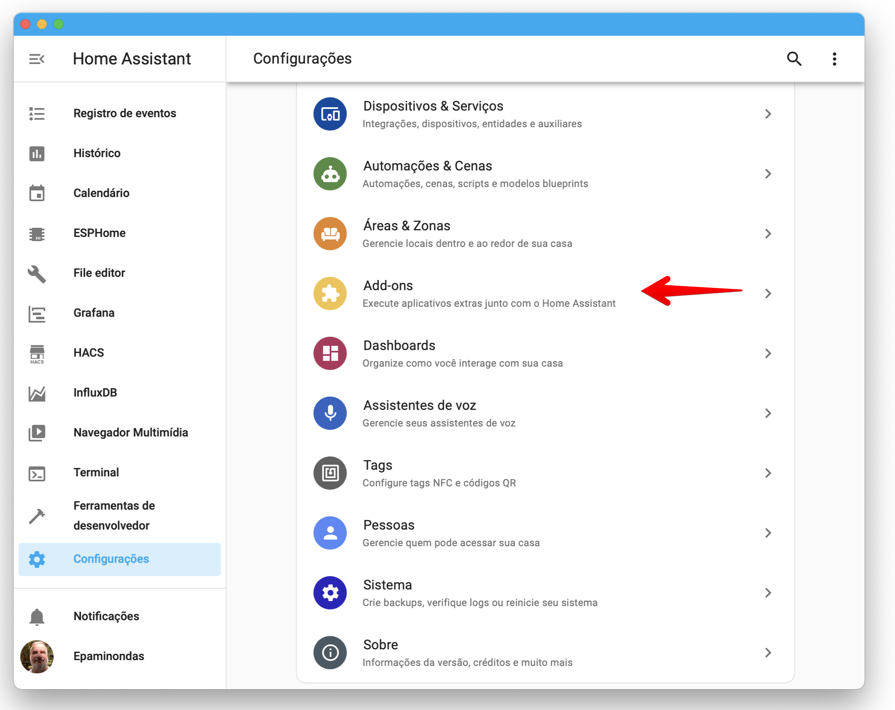
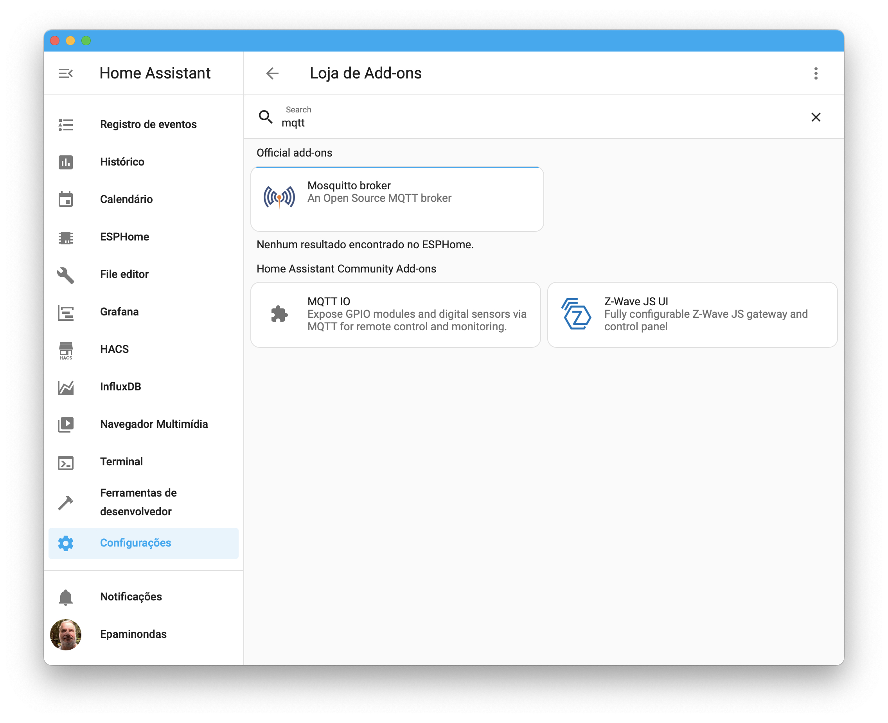
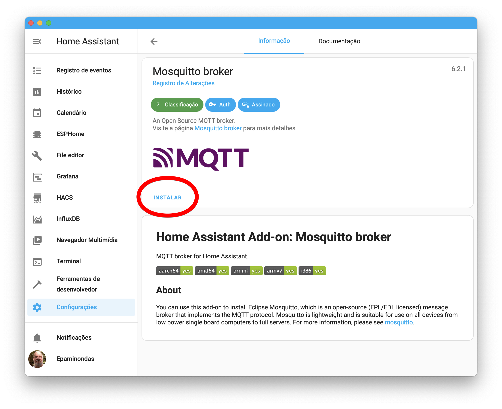
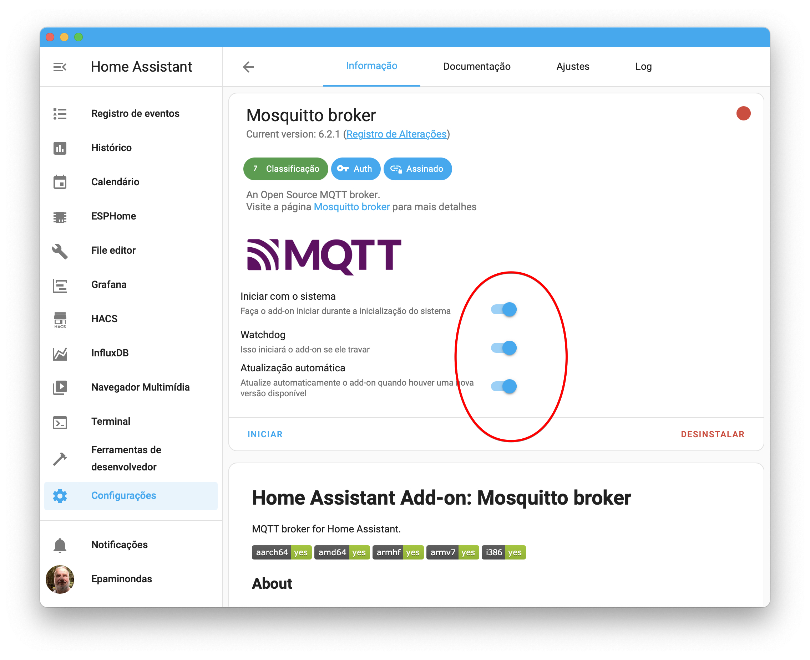
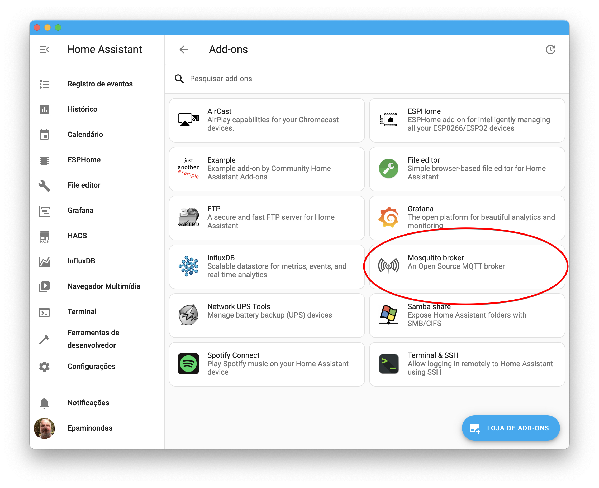

O MQTT (Message Queuing Telemetry Transport) &eacute; um protocolo de comunica&ccedil;&atilde;o m&aacute;quina para m&aacute;quina (M2M) projetado para a Internet das Coisas (IoT) e funciona sobre o protocolo TCP/IP. Ele adota o modelo Publish/Subscribe, onde os dispositivos podem publicar e assinar informa&ccedil;&otilde;es atrav&eacute;s de um broker, que atua como um intermedi&aacute;rio na troca de mensagens.

Desenvolvido pela IBM e Eurotech na d&eacute;cada de 90, o MQTT se destaca pela sua simplicidade, efici&ecirc;ncia e baixo consumo de recursos de rede e banda. Ao contr&aacute;rio do HTTP, amplamente utilizado na comunica&ccedil;&atilde;o entre navegadores e servidores web, o MQTT &eacute; especialmente adequado para projetos de comunica&ccedil;&atilde;o entre m&aacute;quinas (M2M) e conectividade para IoT.

O MQTT oferece vantagens significativas em termos de efici&ecirc;ncia e baixo consumo de recursos. &Eacute; um protocolo ideal para servi&ccedil;os que n&atilde;o exigem o envio de grandes volumes de dados ou a manuten&ccedil;&atilde;o de um hist&oacute;rico de modifica&ccedil;&otilde;es. Sua capacidade de enviar informa&ccedil;&otilde;es pequenas o torna uma excelente op&ccedil;&atilde;o no mercado de IoT, especialmente em situa&ccedil;&otilde;es com restri&ccedil;&otilde;es de largura de banda ou em projetos que demandam solu&ccedil;&otilde;es de baixo custo.

Atualmente, com a disponibilidade de brokers MQTT gratuitos e a facilidade de implementa&ccedil;&atilde;o, testar e integrar o MQTT em projetos se tornou ainda mais acess&iacute;vel. O protocolo &eacute; amplamente utilizado em sensores inteligentes, dispositivos IoT e na transmiss&atilde;o de dados entre dispositivos e a nuvem.

<strong>MQTT x HTTP</strong>

Os modelos de comunica&ccedil;&atilde;o tradicionais utilizam um mecanismo de consulta-resposta para interrogar dispositivos de campo e manter a consci&ecirc;ncia de estado. Os dados s&atilde;o atualizados quando um dispositivo mestre ou aplica&ccedil;&atilde;o emite uma solicita&ccedil;&atilde;o de novos dados, fazendo com que os dispositivos de campo respondam com os dados solicitados. As consultas s&atilde;o frequentemente disparadas de forma c&iacute;clica com base em par&acirc;metros de temporiza&ccedil;&atilde;o.

Enquanto o HTTP &eacute; conhecido por ser pesado, com uma longa lista de cabe&ccedil;alhos de mensagem utilizados para descrever e responder a recursos, o MQTT adota uma abordagem diferente. O MQTT &eacute; agn&oacute;stico em rela&ccedil;&atilde;o aos dados, possuindo uma estrutura de comunica&ccedil;&atilde;o mais enxuta, que pode ser processada de forma eficiente por dispositivos com recursos limitados de energia e processamento.

Figura 1: Message Queuing Telemetry Transport: MQTT

&Eacute; um protocolo de intera&ccedil;&atilde;o IoT baseado no modelo Publicar / Assinar. Este modelo &eacute; um modelo simples que fornece suporte para QoS (Quality of Service).

O MQTT possui mecanismos de toler&acirc;ncia a falhas, incluindo:

<ul class="unchanged rich-diff-level-one" dir="auto">
	<li class="unchanged">N&iacute;veis de qualidade de servi&ccedil;o (QoS) para equilibrar garantia de entrega e sobrecarga de rede.</li>
	<li class="unchanged">Reten&ccedil;&atilde;o de mensagens para fornecer a mensagem mais recente imediatamente a novos assinantes.</li>
	<li class="unchanged">Sess&otilde;es persistentes para armazenar mensagens durante desconex&otilde;es de clientes.</li>
	<li class="unchanged">Testamento (LWT) para enviar uma mensagem especial em caso de interrup&ccedil;&atilde;o inesperada da conex&atilde;o.</li>
</ul>

Esses recursos garantem a confiabilidade na entrega de dados, mesmo em situa&ccedil;&otilde;es de falhas ou mudan&ccedil;as na rede.

Protocolo de Transfer&ecirc;ncia de Hipertexto (HTTP)

&Eacute; utilizado pela World Wide Web (WWW) para definir como suas mensagens ser&atilde;o transmitidas e formatadas. Este protocolo &eacute; respons&aacute;vel pela a&ccedil;&atilde;o que um servidor deve realizar ao enviar informa&ccedil;&otilde;es pela rede.

&nbsp;

Figura 2: HTTP Model

<strong>Aplica&ccedil;&otilde;es do MQTT</strong>

O MQTT &eacute; amplamente utilizado em duas &aacute;reas principais: Ind&uacute;stria 4.0 e dom&oacute;tica (automa&ccedil;&atilde;o residencial).

Na Ind&uacute;stria 4.0, o MQTT desempenha um papel crucial na interconex&atilde;o de dispositivos e coleta de dados, permitindo a troca eficiente de informa&ccedil;&otilde;es entre m&aacute;quinas, equipamentos e sistemas. Isso viabiliza o monitoramento remoto de processos, insights em tempo real e tomada de decis&otilde;es informadas.

Da mesma forma, na dom&oacute;tica, o MQTT &eacute; vital para a comunica&ccedil;&atilde;o entre dispositivos residenciais, como sensores, atuadores, sistemas de controle e aplicativos de gerenciamento residencial. Ele possibilita o controle remoto de ilumina&ccedil;&atilde;o, temperatura, seguran&ccedil;a e outros aspectos da casa, criando um ambiente residencial inteligente.

O MQTT oferece vantagens significativas para a ind&uacute;stria, como a redu&ccedil;&atilde;o de consumo de largura de banda em at&eacute; 80-90% em compara&ccedil;&atilde;o com protocolos de solicita&ccedil;&atilde;o-resposta. Al&eacute;m disso, ele &eacute; altamente escal&aacute;vel, suportando milh&otilde;es de conex&otilde;es e permitindo o compartilhamento flex&iacute;vel de dados entre sistemas.

Figura 3: Conex&otilde;es ponto a ponto x Redes com Broker

A natureza desacoplada da troca de dados no MQTT &eacute; outro aspecto importante, pois elimina a necessidade de conex&otilde;es ponto a ponto ou endere&ccedil;amento direto. Isso possibilita que as redes MQTT cres&ccedil;am e compartilhem dados de forma flex&iacute;vel, sem afetar o tr&aacute;fego de rede entre os publicadores e o broker. Al&eacute;m disso, os assinantes n&atilde;o precisam ser reconfigurados em caso de altera&ccedil;&otilde;es no tipo de dispositivo de campo ou endere&ccedil;o IP.

Em termos t&eacute;cnicos, o MQTT utiliza uma carga &uacute;til simples em formato de matriz de bytes, acompanhada por um cabe&ccedil;alho fixo de 2 bytes e campos de cabe&ccedil;alho de comprimento vari&aacute;vel. Essa abordagem simplificada permite uma transmiss&atilde;o eficiente de dados pela rede, minimizando o consumo de recursos.

Figura 4: MQTT Standard Packet

Em resumo, o MQTT &eacute; um protocolo eficiente e confi&aacute;vel para a comunica&ccedil;&atilde;o em projetos de IoT e M2M. Sua simplicidade, baixo consumo de recursos e suporte ao modelo Publish/Subscribe o tornam uma escolha popular na troca de dados entre dispositivos, impulsionando a evolu&ccedil;&atilde;o da Ind&uacute;stria 4.0 (IIoT) e da dom&oacute;tica (IoT) e viabilizando a transforma&ccedil;&atilde;o digital em diversos setores industriais.

<strong>Formas de comunica&ccedil;&atilde;o</strong>

No Protocolo MQTT, a publica&ccedil;&atilde;o e o recebimento de dados s&atilde;o realizados atrav&eacute;s de um tipo de servidor chamado de Broker. Ou seja, nessa comunica&ccedil;&atilde;o haver&aacute; ent&atilde;o um cliente que ter&aacute; o papel de Publisher (Publicador) e transmitir&aacute; a mensagem, com um t&oacute;pico de destino e o seu Payload (o conte&uacute;do da mensagem).

Figura 5: Conex&otilde;es entre Publish e Subscriber

Essa mensagem em quest&atilde;o ser&aacute; ent&atilde;o transmitida ao Broker que, por sua vez, ser&aacute; o respons&aacute;vel por geri-la e encaminh&aacute;-la ao Subscriber que foi previamente inscrito no t&oacute;pico. Dessa forma, os Subscribers recebem apenas as mensagens relacionadas aos t&oacute;picos aos quais se inscreveram, garantindo uma comunica&ccedil;&atilde;o mais eficiente e direcionada.

Seguindo essa mesma linha, caso o cliente queira tornar-se um Subscriber em algum t&oacute;pico, ele dever&aacute; apenas encaminhar uma solicita&ccedil;&atilde;o ao Broker que ser&aacute; capaz de fazer uma liga&ccedil;&atilde;o entre o cliente e o t&oacute;pico em quest&atilde;o. Essa flexibilidade de inscri&ccedil;&atilde;o e publica&ccedil;&atilde;o permite que os dispositivos IoT e outros sistemas se comuniquem de forma din&acirc;mica e sob demanda.

Al&eacute;m disso, a utiliza&ccedil;&atilde;o do Broker como intermedi&aacute;rio na comunica&ccedil;&atilde;o traz uma vantagem significativa: os dispositivos n&atilde;o precisam estar conectados ao mesmo tempo para trocar informa&ccedil;&otilde;es. O Broker armazena temporariamente as mensagens destinadas aos Subscribers inativos e as entrega assim que esses dispositivos se conectam novamente &agrave; rede.

Com isso, o Protocolo MQTT oferece um mecanismo robusto e eficiente para comunica&ccedil;&atilde;o em cen&aacute;rios de IoT e aplica&ccedil;&otilde;es M2M, possibilitando uma troca de dados &aacute;gil e econ&ocirc;mica em ambientes com recursos limitados.

Figura 6: Publisher &ndash; Broker - Subscriber

De forma simplificada, essa comunica&ccedil;&atilde;o pode ser dividida entre os seguintes termos:

<ul class="unchanged rich-diff-level-one" dir="auto">
	<li class="unchanged">Subscriber (Subscrito) &ndash; a pessoa que estar&aacute; inscrita no t&oacute;pico e ir&aacute; ter o papel de receptor.</li>
	<li class="unchanged">Publisher (Publicador) &ndash; a pessoa que estar&aacute; respons&aacute;vel por ser o emissor e enviar os dados para um determinado t&oacute;pico.</li>
	<li class="unchanged">Broker &ndash; ser&aacute; o intermedi&aacute;rio para fazer uma ponte de comunica&ccedil;&atilde;o entre o Publisher e o Subscriber, se tornando respons&aacute;vel por fazer o recebimento, enfileiramento e envio das mensagens.</li>
	<li class="unchanged">T&oacute;pico &ndash;ser&aacute; o endere&ccedil;o pelo qual os dados das mensagens ser&atilde;o enviados.</li>
	<li class="unchanged">Client (Cliente) &ndash; ser&aacute; o elemento que ter&aacute; a capacidade de interagir com o Broker, podendo enviar e receber dados.</li>
	<li class="unchanged">Mensagem &ndash; ser&aacute; o pacote de dados trocados entre os clientes e o Broker.</li>
	<li class="unchanged">Unsubscribe &ndash; permite deixar de assinar um determinado t&oacute;pico.</li>
	<li class="unchanged">Payload &ndash; ser&aacute; o conte&uacute;do da mensagem que ser&aacute; enviada.</li>
</ul>

<strong>Vantagens do Protocolo MQTT:</strong>

<ol class="unchanged rich-diff-level-one" dir="auto">
	<li class="unchanged">Baixo consumo de recursos: O MQTT &eacute; conhecido por seu baixo consumo de mem&oacute;ria e banda, permitindo que dispositivos IoT com recursos limitados possam implementar o protocolo de forma eficiente. O tamanho reduzido das mensagens e dos cabe&ccedil;alhos do MQTT otimiza a utiliza&ccedil;&atilde;o da largura de banda da rede.</li>
	<li class="unchanged">Escalabilidade: O MQTT foi projetado para suportar uma grande quantidade de dispositivos IoT. Com uma implementa&ccedil;&atilde;o m&iacute;nima de c&oacute;digo e baixo consumo de energia, o protocolo permite a conex&atilde;o de milh&otilde;es de dispositivos de forma escal&aacute;vel.</li>
	<li class="unchanged">Confiabilidade: O MQTT oferece recursos de qualidade de servi&ccedil;o (QoS) para garantir a entrega confi&aacute;vel das mensagens. O n&iacute;vel de QoS pode ser configurado de acordo com a import&acirc;ncia e a necessidade de recebimento das mensagens.</li>
	<li class="unchanged">Seguran&ccedil;a: O MQTT oferece um alto n&iacute;vel de seguran&ccedil;a para as mensagens transmitidas. O protocolo suporta certificados SSL (Secure Socket Layer) e criptografia avan&ccedil;ada para proteger as informa&ccedil;&otilde;es. Al&eacute;m disso, &eacute; poss&iacute;vel configurar mecanismos de autentica&ccedil;&atilde;o e prote&ccedil;&atilde;o de informa&ccedil;&otilde;es no Broker, garantindo a integridade dos dados. &Eacute; importante ressaltar que o MQTT permite a autentica&ccedil;&atilde;o do cliente com nome de usu&aacute;rio e senha, e o uso do SSL para criptografar a comunica&ccedil;&atilde;o na rede, embora essa op&ccedil;&atilde;o possa adicionar uma sobrecarga significativa &agrave; rede devido &agrave; natureza pesada do protocolo SSL.</li>
</ol>

<strong>Instala&ccedil;&atilde;o do Mosquitto no Home Assistant</strong>

No Home Assistant (HA), o Mosquitto MQTT broker &eacute; um add-on comumente utilizado para permitir a comunica&ccedil;&atilde;o entre dispositivos que usam o protocolo MQTT, como dispositivos com firmware Tasmota. Para garantir uma conex&atilde;o segura e de bom desempenho, &eacute; recomendado instalar o Mosquitto MQTT broker no Supervisor do HA.

Para adicionar o Mosquitto MQTT broker, siga estas etapas:

<ol class="unchanged rich-diff-level-one" dir="auto">
	<li class="unchanged">Acesse o painel do Home Assistant.</li>
	<li class="unchanged">Clique no &iacute;cone de Configura&ccedil;&otilde;es (engrenagem) no canto inferior esquerdo.</li>
</ol>

<ol class="unchanged rich-diff-level-one" dir="auto" start="3">
	<li class="unchanged">Na p&aacute;gina do Supervisor, clique em &quot;Add-on Store&quot; (Loja de Add-ons), localizado no canto direito inferior.</li>
	<li class="unchanged">Na loja de add-ons, procure por &quot;MQTT&quot; na barra de pesquisa.</li>
</ol>

<ol class="unchanged rich-diff-level-one" dir="auto" start="5">
	<li class="unchanged">O add-on &quot;Mosquitto broker&quot; deve aparecer nos resultados da pesquisa. Clique nele para obter mais informa&ccedil;&otilde;es.</li>
	<li class="unchanged">Na p&aacute;gina do add-on Mosquitto broker, clique no bot&atilde;o <strong>Instalar</strong> para iniciar o processo de instala&ccedil;&atilde;o.</li>
</ol>

<ol class="unchanged rich-diff-level-one" dir="auto" start="7">
	<li class="unchanged">Aguarde at&eacute; que a instala&ccedil;&atilde;o seja conclu&iacute;da. Isso pode levar alguns minutos. Ative as op&ccedil;&otilde;es abaixo.</li>
</ol>

<ol class="unchanged rich-diff-level-one" dir="auto" start="8">
	<li class="unchanged">Ap&oacute;s a instala&ccedil;&atilde;o, volte para a p&aacute;gina do Supervisor e clique em &quot;Configura&ccedil;&otilde;es&quot; novamente para verificar se completou a instala&ccedil;&atilde;o.</li>
</ol>

<ol class="unchanged rich-diff-level-one" dir="auto" start="9">
	<li class="unchanged" dir="ltr">Voc&ecirc; deve ver o add-on do Mosquitto MQTT broker listado l&aacute;. Clique nele para acessar as op&ccedil;&otilde;es de configura&ccedil;&atilde;o.</li>
	<li class="unchanged" dir="ltr">Confira as op&ccedil;&otilde;es conforme suas necessidades, como nome de usu&aacute;rio, senha, porta MQTT, etc.</li>
	<li class="unchanged" dir="ltr">Salve as configura&ccedil;&otilde;es e inicie o add-on.</li>
</ol>

Uma vez que o add-on do Mosquitto MQTT broker esteja instalado e em execu&ccedil;&atilde;o, voc&ecirc; poder&aacute; utilizar dispositivos que se conectem via MQTT, como dispositivos com firmware Tasmota, para se comunicarem com o broker. Certifique-se de configurar corretamente os dispositivos para se conectarem ao broker Mosquitto usando o endere&ccedil;o IP ou o nome de host do seu Home Assistant.

Bibliografia:

<ol>
	<li class="unchanged">Wikipedia:
	<ul style="list-style-type:circle">
		<li class="unchanged">MQTT. In: WIKIPEDIA: a enciclop&eacute;dia livre. [S.l.], 2021. Dispon&iacute;vel em: <a href="https://pt.wikipedia.org/wiki/MQTT" style="color:blue; text-decoration:underline" target="_new">https://pt.wikipedia.org/wiki/MQTT</a>. Acesso em: 6 jul. 2023.</li>
	</ul>
	</li>
	<li class="unchanged">Amazon Web Services:
	<ul style="list-style-type:circle">
		<li class="unchanged">AWS. What is MQTT? [S.l.], [202-?]. Dispon&iacute;vel em: <a href="https://aws.amazon.com/pt/what-is/mqtt/" style="color:blue; text-decoration:underline" target="_new">https://aws.amazon.com/pt/what-is/mqtt/</a>. Acesso em: 6 jul. 2023.</li>
	</ul>
	</li>
	<li class="unchanged">IBM:
	<ul style="list-style-type:circle">
		<li class="unchanged">IBM. Conhecendo o MQTT. [S.l.], [202-?]. Dispon&iacute;vel em: <a href="https://www.ibm.com/developerworks/br/library/iot-mqtt-why-good-for-iot/index.html" style="color:blue; text-decoration:underline" target="_new">https://www.ibm.com/developerworks/br/library/iot-mqtt-why-good-for-iot/index.html</a>. Acesso em: 31 mai. 2023.</li>
	</ul>
	</li>
	<li class="unchanged">Protocolo MQTT:
	<ul style="list-style-type:circle">
		<li class="unchanged">[Protocolo MQTT]. [S.l.], [202-?]. Dispon&iacute;vel em: <a href="https://materiais.hitecnologia.com.br/media/Protocolo%20MQTT.jpg" style="color:blue; text-decoration:underline" target="_new">https://materiais.hitecnologia.com.br/media/Protocolo%20MQTT.jpg</a>. Acesso em: 6 jul. 2023.</li>
	</ul>
	</li>
	<li class="unchanged">Silva, Leonardo Jos&eacute; Nascimento:
	<ul style="list-style-type:circle">
		<li class="unchanged">SILVA, Leonardo Jos&eacute; Nascimento. Utilizando o Home Assistant e o NodeMCU para um modelo gen&eacute;rico de automa&ccedil;&atilde;o moderna. S&atilde;o Crist&oacute;v&atilde;o, SE, 2019. Monografia (gradua&ccedil;&atilde;o em Ci&ecirc;ncias da Computa&ccedil;&atilde;o)&ndash; Curso de Ci&ecirc;ncia da Computa&ccedil;&atilde;o, Departamento de Computa&ccedil;&atilde;o, Centro de Ci&ecirc;ncias Exatas e Tecnologia, Universidade Federal de Sergipe, S&atilde;o Crist&oacute;v&atilde;o, 2019.</li>
	</ul>
	</li>
	<li class="unchanged">Home Assistant:
	<ul style="list-style-type:circle">
		<li class="unchanged">HOME ASSISTANT. MQTT. [S.l.], [202-?]. Dispon&iacute;vel em: <a href="https://www.home-assistant.io/integrations/mqtt/" style="color:blue; text-decoration:underline" target="_new">https://www.home-assistant.io/integrations/mqtt/</a>. Acesso em: 6 jul. 2023.</li>
		<li class="unchanged">Protocolo MQTT. [S.l.], [202-?]. Dispon&iacute;vel em: <a href="https://materiais.hitecnologia.com.br/media/Protocolo%20MQTT" style="color:blue; text-decoration:underline" target="_new">https://materiais.hitecnologia.com.br/media/Protocolo%20MQTT</a>. Acesso em: 6 jul. 2023.</li>
	</ul>
	</li>
	<li class="unchanged">Reposit&oacute;rio no GitHub:
	<ul style="list-style-type:circle">
		<li class="unchanged">HOME ASSISTANT. Mosquitto MQTT broker. [S.l.]: GitHub, [202-?]. Dispon&iacute;vel em: <a href="https://github.com/home-assistant/addons/blob/master/mosquitto/README.md" style="color:blue; text-decoration:underline" target="_new">https://github.com/home-assistant/addons/blob/master/mosquitto/README.md</a>. Acesso em: 6 jul. 2023.</li>
	</ul>
	</li>
</ol>

&nbsp;

&nbsp;

